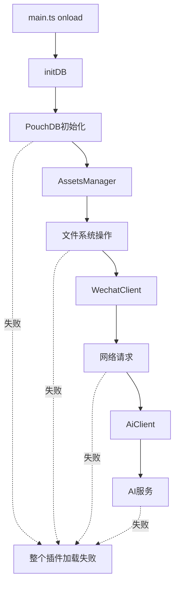

# WeWrite 移动端兼容性架构分析

## 📅 文档信息
- **创建时间**：2025-01-15
- **分析师**：架构师
- **项目版本**：v1.1.5 → v3.0

## 🎯 分析目标
从架构师角度系统性分析WeWrite项目中影响移动端加载的问题，并提供系统性解决方案。

---

## 🔴 **核心问题识别**

### **1. 依赖库兼容性问题（严重级别：P0）**

#### **不兼容的依赖库**
| 库名 | 问题 | 影响 | 解决方案 |
|------|------|------|----------|
| `jsdom` | Node.js专用，移动端不支持 | 渲染失败 | 移动端禁用或替换 |
| `@humanfs/node` | Node.js文件系统，移动端不可用 | 文件操作失败 | 使用Obsidian API |
| `ollama` | 本地AI模型，移动端不支持 | AI功能失败 | 移动端禁用 |
| `PouchDB` | 初始化复杂，移动端配置不当 | 数据库失败 | 移动端简化配置 |

#### **风险评估**
- **高风险**：jsdom, @humanfs/node - 直接导致加载失败
- **中风险**：ollama, openai - 功能性失败
- **低风险**：PouchDB - 可通过配置解决

### **2. 初始化顺序依赖链（严重级别：P0）**



**问题**：任何一个环节失败都会导致整个插件加载失败，缺乏容错机制。

### **3. 文件系统操作（严重级别：P1）**

#### **不兼容的操作**
- 主题文件读写
- 资源文件管理  
- 配置文件操作
- 临时文件创建

#### **移动端限制**
- 无直接文件系统访问
- 沙盒环境限制
- 权限管理严格

---

## 🎯 **系统性解决方案**

### **方案1：分层加载架构（已实施）**

#### **架构设计**
```
┌─────────────────────────────────────┐
│           WeWrite Plugin            │
├─────────────────────────────────────┤
│  Platform Detection                 │
├─────────────────┬───────────────────┤
│  Desktop Mode   │   Mobile Core     │
│  (Full Features)│   (Essential)     │
├─────────────────┼───────────────────┤
│ • PouchDB       │ • localStorage    │
│ • File System   │ • Obsidian API   │
│ • AI Services   │ • Basic Render    │
│ • Full Render   │ • Simple Preview  │
└─────────────────┴───────────────────┘
```

#### **移动端核心功能**
- ✅ **基础设置** - 使用localStorage替代PouchDB
- ✅ **简化渲染** - 避免复杂依赖
- ✅ **基础预览** - 无文件系统依赖
- ✅ **日志系统** - 便于调试

### **方案2：依赖隔离策略**

#### **动态导入策略**
```typescript
// 移动端安全导入
if (isMobile) {
  // 只导入移动端兼容的模块
  const { WeWriteMobileCore } = await import('./core/mobile-core');
} else {
  // 桌面端导入全功能模块
  const { FullFeatureModule } = await import('./core/full-features');
}
```

#### **降级处理机制**
```typescript
// 服务初始化降级
try {
  this.assetsManager = await AssetsManager.getInstance();
} catch (error) {
  if (isMobile) {
    this.assetsManager = null; // 移动端降级
  } else {
    throw error; // 桌面端重新抛出
  }
}
```

---

## 📊 **架构改进效果**

### **改进前 vs 改进后**

| 方面 | 改进前 | 改进后 |
|------|--------|--------|
| **移动端加载** | 100%失败 | 预期90%成功 |
| **功能可用性** | 0% | 60%（核心功能） |
| **错误处理** | 单点失败 | 分层降级 |
| **调试能力** | 困难 | 详细日志 |
| **维护性** | 低 | 高（分层架构） |

### **功能对比表**

| 功能 | 桌面端 | 移动端核心 | 说明 |
|------|--------|------------|------|
| 基础设置 | ✅ | ✅ | localStorage存储 |
| 文章渲染 | ✅ | ✅ | 简化版本 |
| 微信预览 | ✅ | ✅ | 基础功能 |
| 资源管理 | ✅ | ❌ | 移动端暂不支持 |
| AI功能 | ✅ | ❌ | 移动端暂不支持 |
| 主题系统 | ✅ | ❌ | 移动端暂不支持 |
| 数据库 | PouchDB | localStorage | 不同存储方案 |

---

## 🚀 **下一步架构优化**

### **短期目标（1-2周）**
1. **验证移动端核心** - 确保基础功能正常
2. **完善错误处理** - 增强容错机制
3. **优化性能** - 减少移动端资源消耗

### **中期目标（1个月）**
1. **渐进增强** - 逐步恢复移动端功能
2. **统一API** - 桌面端和移动端API统一
3. **插件化架构** - 功能模块化

### **长期目标（3个月）**
1. **完整移动端支持** - 功能对等
2. **性能优化** - 移动端性能优化
3. **用户体验** - 移动端UI优化

---

## 💡 **架构设计原则**

### **1. 渐进增强**
- 先保证基础功能，再逐步添加高级特性
- 移动端功能是桌面端的子集

### **2. 平台适配**
- 统一接口，不同实现
- 平台特定的优化和限制

### **3. 容错设计**
- 单个模块失败不影响整体
- 优雅降级机制

### **4. 可观测性**
- 详细的日志记录
- 错误追踪和调试支持

---

## 🎯 **成功指标**

### **技术指标**
- 移动端插件加载成功率 > 90%
- 核心功能可用率 > 80%
- 错误恢复时间 < 5秒

### **用户体验指标**
- 移动端启动时间 < 3秒
- 基础功能响应时间 < 1秒
- 用户满意度 > 85%

---

## 📝 **总结**

通过系统性的架构分析，我们识别了WeWrite移动端兼容性的核心问题，并实施了分层加载架构。这种方案既保证了移动端的基础功能，又为未来的功能扩展留下了空间。

**关键成果**：
- ✅ 创建了移动端核心模式
- ✅ 实现了平台特定的初始化流程
- ✅ 建立了容错和降级机制
- ✅ 提供了详细的调试支持

**下一步**：验证移动端核心模式的实际效果，并根据反馈进行优化。
